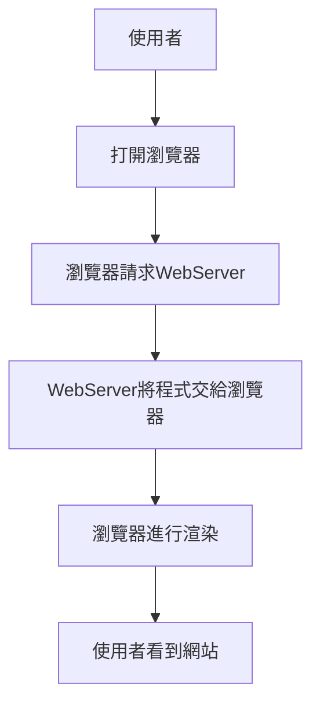
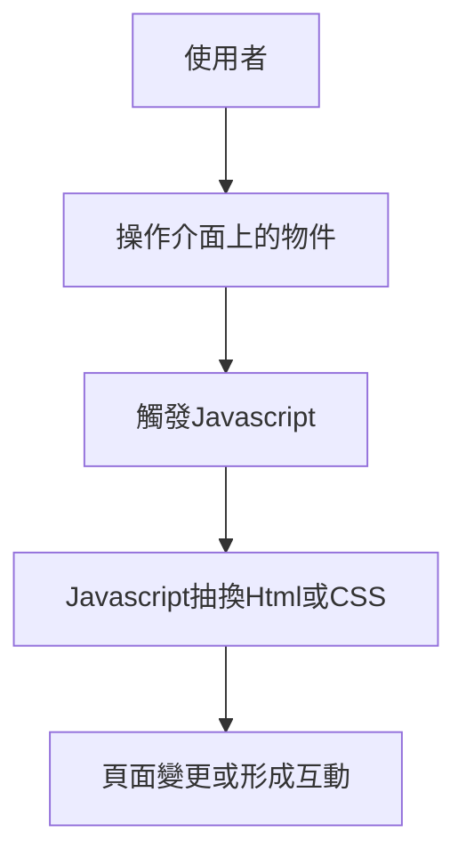

# 淺談網頁前端


## 分辨前端 Front-end
User 可以看到的地方都是前端
網頁F12打開可以看到的地方都是前端

### 常見職稱
- 前端工程師
- 前端設計師 (UI/UX工程師)


### 流程及角色
#### Html, CSS, Javascript的幹嘛的?


#### 渲染流程

> 瀏覽器扮演負責 "解析程式" 並 "形成畫面" 給使用者看，因此每個瀏覽器解析的結果都不太一樣，如支援的語言版本、CSS渲染的樣式

> 大部分的瀏覽器遵從W3C規範

> 目前的CSS3已經能形成動態互動，部分互動不需要再使用Javascript
#### Javascript運作流程(完成渲染後)



> 可以發現都是由使用者操作為起點，大部分的前端行為都是由使用者觸發，伺服器不會主動傳輸

> 例外: Websocket等技術，由伺服器主動呼叫客戶端。


### 視角
#### 開發者看到的:
- Html
- CSS
	- SCSS
	- SASS
	- LESS
	- etc.
- Javascript
	- Typescript
- 其他多媒體

#### 瀏覽器會看到的:
- Html
- CSS
- Javascript
- 其他多媒體

#### 使用者會看到的:
- 文字
- 多媒體
- 互動動畫

#### 探討-舊世代的前後端混合架構
##### 常用的前後端混合
- PHP
- JAVA (JSP)
- ASP
- etc.


##### 討論1: 我用PHP或其他程式語言寫前端所以是PHP前端?

```` java
// index.jsp
<%="Hello Word"%>
````

```` php
<!-- index.php -->
<?php echo "HelloWorld";?>
````

##### 討論2: 我寫了一個http協議的API也可以在瀏覽器上瀏覽，那這些也是前端?

```` go
// Golang Gin
router.GET("/", func(context *gin.Context) {
	c.String(http.StatusOK, "HelloWorld") 
	})

````

```` python
# Python FastAPI
@app.get("/")
async def root():
    return {"message": "HelloWorld"}
````

```` javascript
// Nodejs Express
app.get('/', (req, res) => {
  res.send('HelloWorld')
})
````


## 現代網頁技術-SPA
全名:Single page application
翻譯:單頁面應用程式

### 原理

將所有的物件都使用javascript進行載入抽換

### 優點
使用者體驗更好
- 減少重新載入時間
- UI更滑順

### 缺點
- SEO
- 體積肥大

### SEO缺點改善
由客戶端渲染稱為CSR
- 伺服器端渲染-SSR
讓後端渲染好之後再交給瀏覽器

- 靜態網站產生器-SSG
在部署前將SPA轉換成靜態網站

### 主流三大框架
都以Typescript作為預設開發語言
- Angular 
Google主導開發的框架，很肥很大很完整，適合大型專案使用 (Angularjs 不等於 Angular)
誰用了: Google很多網站, PayPal
- React
Meta主導的，我也不知道他的特色是什麼，但好像是始祖
誰用了: Udemy, Linked-in
- Vue
大陸人開源的，好學又輕又方便隨時都能用，最多人用的
誰用了: 到處都是

### 平常可以看到哪些SPA
介紹網站太無聊了介紹點驚人的
#### 電腦上的
- Visual Studio Code
- Discord
- LOL Client
- Steam
- etc.
#### 手機上的
- Google Map
- Gmail
- etc.

### 補充-怎麼製作一個像Discord的桌面應用程式
由微軟開源的 [electron](https://www.electronjs.org/)

#### 探討-為什麼不上網也能用?

### 探討-現代網頁的強大
一份程式碼通用
- MacOS
- iOS
- Android
- 各種Linux
- ChromeOS
- Windows
- 各種TV OS


###### tags: `入門`, `Ruisi`, `前端`